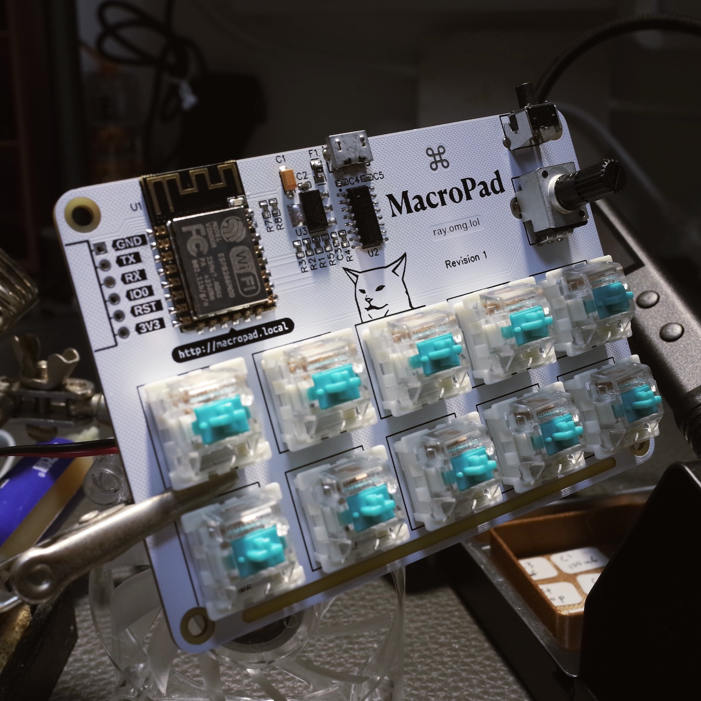
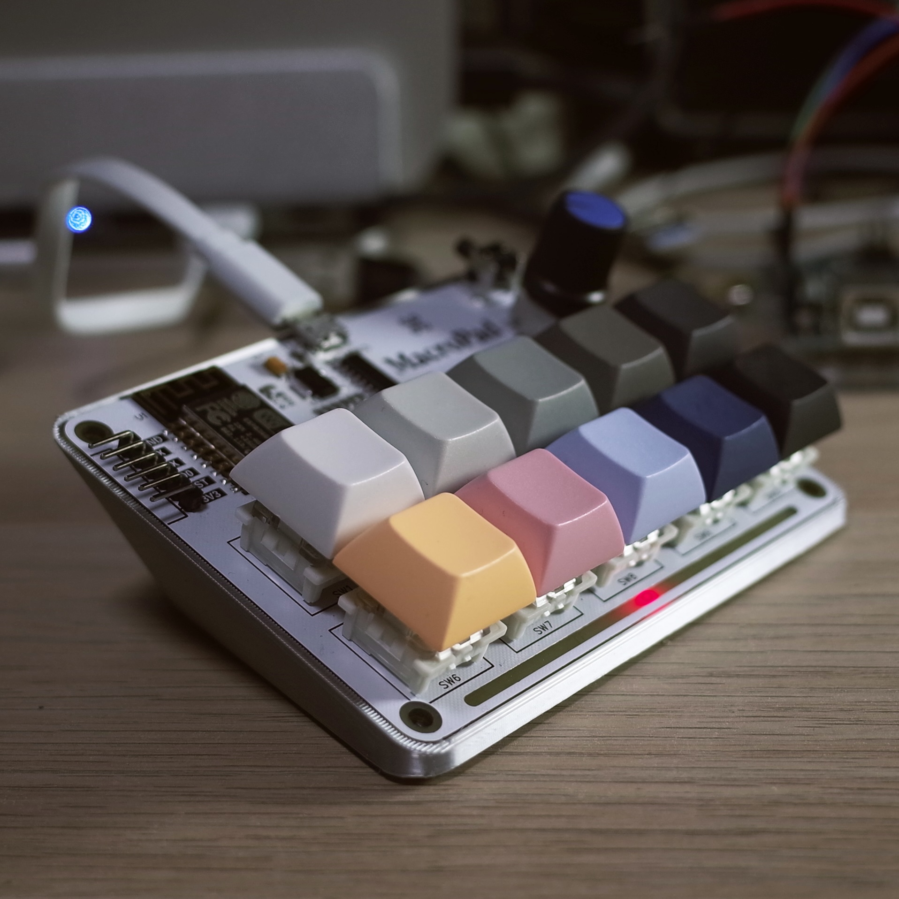

# MacroPad 🚧
```
o       o   o-O-o    o--o  
|       |     |      |   | 
o   o   o     |      O--o  
 \ / \ /      |      |     
  o   o     o-O-o    o     
```
This project is currently in development.

More details and documentation will be added soon.

# Hardware

|  |  |
| - | - | 
|  |  | 

### PCB

- [Exported EasyEDA Project](hardware/EasyEDA)

- [Schematic (PDF)](hardware/Schematic_MacroPad_2022-03-30.pdf)

- [Manufacturing Files (Gerber)](hardware/Gerber)

- [BOM (CSV)](hardware/BOM_MacroPad_2022-03-30.csv)

### 3D Printing Parts

There's 2 parts you can print
- Body: The stand or case whatever you call it, shown in the picture above.
- Spacer: To align the keys while soldering. This is optional.

[3D Printing Parts (STL/AMF/FreeCAD)](hardware/3D%20Prints)

It's recommended to place 4 **Silicone Rubber Feet** with diameter of 10mm underneath the body to prevent slipping.


# Web Interface
`http://macropad.local/`


The web interface is a Vue.js application.

See [/web](web) for more information.

# API

| **Method** | **URL** | **Description** | **Done** |
| :--- | :--- | :--- | :---: |
| `GET` | `/api/config` | read config | ✅ |
| `POST` | `/api/config` | write config | ✅ |
| `DELETE` | `/api/config` | delete config | ✅ |
| `GET` | `/api/restart` | restart | ✅ |
| `GET` | `/api/reset` | earase all settings | ✅ |

# Build / Development

> TODO: Add more information about development.

Clone this project

`git clone git@github.com:RayPS/MacroPad.git`

Open this project in PlatformIO

Update `upload_port`

Update `monitor_port` (optional, if you want to see debug messages from SoftwareSerial, otherwise remove this option)

Finally, upload to the board.

### Web Interface Development

`cd MacroPad/web`

`yarn install`

`yarn run dev` to start web development or `yarn run build` to build the html PROGREM for the firmware.

(After `yarn run build`, you can perform an upload in PlatformIO again)

# Macro Script Proposal

<table>
    <thead>
        <tr>
            <th>Syntax</th>
            <th>Feature</th>
            <th>Done</th>
        </tr>
    </thead>
    <tbody>
        <tr>
            <td>
<pre># This is a comment
@ CTRL SHIFT CMD F1
$ Hello world!
! 1200
~ 50
+ WIN R
- WIN R
.</pre>
            </td>
            <td>
<pre>comment
shortcut
string
wait (ms)
interval (ms)
press key
release key
release all keys</pre>
            </td>
            <td>
<pre>✅
✅
✅
✅
❌
✅
✅
✅</pre>
            </td>
        </tr>
    </tbody>
</table>

# Todo
- Hardware
    - PCB
        - [ ] Use USB-C instead of Micro USB 😅
    - 3D Prints
        - [ ] Design the top case
        - [ ] Printable potentiometer cap, maybe
- Software
    - Firmware
        - [ ] Decide the functionality for the potentiometer
        - [ ] Fix the SW0 (IO9) crash
        - [ ] Implementation of ~Interval, don't see any use case yet
    - Web Interface
        - [x] Add a "usage/reference" page
        - [ ] Syntax highlighting
        - [ ] Config saving guard (macro syntax validation)

Features Roadmap:
- Remote execution
- Multi-configs